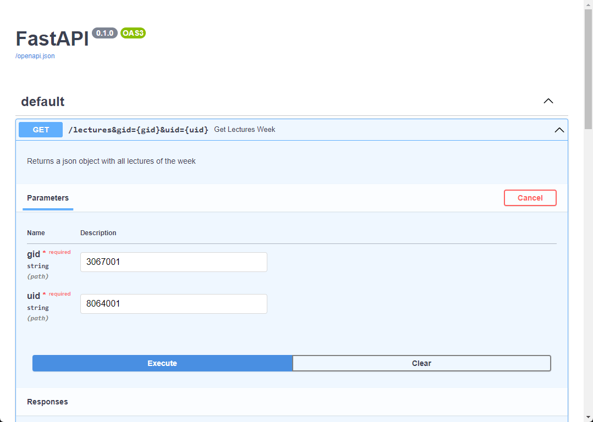

# DHBW Mannheim Lectures API


## Key Features
This API allows users to retrieve information about weekly or monthly lectures for a given course by providing the course ID (GID) and user ID (UID) at DHBW Mannheim. Since the timestamps one can provide within the DHBW Mannheim website are buggy and do not work properly, this API only provides the current week or month. It does not use the ICS file provided by the DHBW Mannheim website, but instead scrapes the website itself which results in an always up-to-date result.

## Usage
The api needs the following parameters:

- `gid`: The unique identifier for the faculty.
- `uid`: The unique identifier for the course.

### Get Weekly Lectures
This endpoint returns the lectures for the current week. The week starts on Monday and ends on Saturday.
Url: `http://endpoint/lectures&gid=<GID>&uid=<UID>`
e.g. `http://localhost/lectures&gid=3067001&uid=8064001`

### Get Monthly Lectures
This endpoint returns the lectures for the current month. The month starts on the first day of the month and ends on the last day of the month.
Url: `http://endpoint/monthly&gid=<GID>&uid=<UID>&view=month`
e.g. `http://localhost/monthly&gid=3067001&uid=8064001&view=month`

## API Response

The API response is a JSON object with the following structure:

```json
[
  {
    "name": "Offensive Security",
    "date": "06.02.2023",
    "start_time": "10:00",
    "end_time": "12:30",
    "room": "Raum 336B",
    "info": null
  },
  {
    "name": "Digitale Forensik",
    "date": "08.02.2023",
    "start_time": "09:00",
    "end_time": "12:00",
    "room": "Raum 336B",
    "info": null
  },
  ...
]
```
Online lectures are stated as "Online" in the info field. In this case no room is provided (if correctly stated in the DHBW Mannheim website).

In case of the name, the date, the start_time or the end_time of a lecture is missing, it is not provided by the API.

However, room and info are optional and may be null.